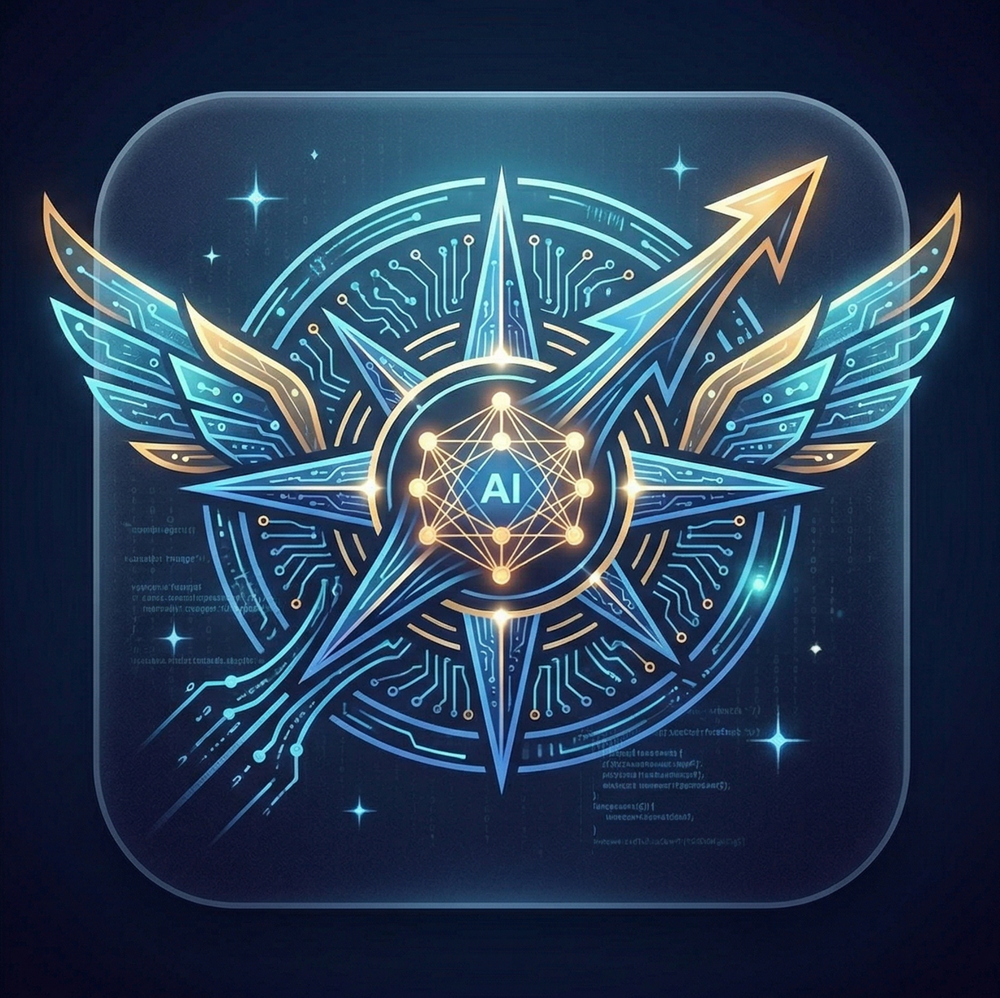

<p align="center">
  
</p>

# Life Pilot Agent -- AI Life Assistant

**A personal AI assistant designed by a practicing psychologist.**

Not another task manager or chatbot. Life Pilot is a personal operating system that captures your thoughts, manages your tasks, coaches you through structured reflection, and holds free-form conversations -- all through a single Telegram interface. The coaching protocol is built on professional psychology frameworks, not generic productivity advice.

Built on [Claude Code](https://docs.anthropic.com/en/docs/claude-code) + [MCP Protocol](https://modelcontextprotocol.io/) with Google Calendar, Todoist, and Obsidian integrations.

> [Версия на русском](README.ru.md)

---

## Why Life Pilot?

Most productivity tools solve the wrong problem. They help you organize tasks -- but tasks aren't the bottleneck. The bottleneck is knowing what actually matters, noticing when you're stuck, and adjusting course before months slip by.

Life Pilot closes this gap:

| Typical tool | Life Pilot |
|---|---|
| Stores notes | Captures -> classifies -> creates tasks -> links to goals |
| You check calendar | Morning briefing arrives automatically |
| Review? What review? | Weekly digest with coaching questions |
| Goals written once, forgotten | Monthly planning sessions via guided dialogue |
| No reflection system | GROW coaching cycle: week -> month -> quarter -> year |
| Generic prompts | Questions crafted by a practicing psychologist |
| No AI conversation | Free Chat and Coach Mode for any question or situation |

**One Telegram bot. Voice-first. Runs 24/7 on your VPS.**

---

## The Idea Behind It

This project was created by a practicing psychologist who saw a pattern in clients: people don't lack ambition or intelligence -- they lack a consistent system for reflection and self-correction.

Three core principles shaped the design:

**1. Capture without friction.** Voice message in Telegram -- done. No apps to open, no forms to fill. The AI handles classification, task creation, and storage. Your job is just to talk.

**2. Rhythm over motivation.** Morning plan. Evening report. Weekly reflection. Monthly review. Quarterly check-in. Yearly cycle. The system creates rhythm -- and rhythm creates progress, even when motivation fades.

**3. Professional coaching, automated.** The GROW coaching protocol isn't a chatbot gimmick. The question bank was designed by a psychologist -- supportive tone, no judgment, pattern recognition, gentle confrontation of avoidance. The AI adapts questions to your real data: actual goals, overdue tasks, recurring blockers.

---

## What It Does

### Capture Everything
Send anything to Telegram -- the agent figures out what to do with it:
- **Voice messages** -> transcribed (Groq Whisper, free) -> classified -> stored or tasked
- **Text** -> parsed for tasks, ideas, learnings
- **Photos** -> saved with context
- **Forwarded messages** -> extracted and categorized

### Smart Task Management
- Auto-creates tasks in **Todoist** with correct projects and priorities
- Sorts incoming thoughts into categories: ideas, learnings, projects, reflections
- Detects stale tasks and prompts you to act
- Tracks transfers and overdue patterns

### Daily Rhythm
- **Morning plan** (`/plan`) -- sent automatically with today's calendar events, tasks, and priorities
- **Evening report** -- summary of what was captured and processed
- **Weekly digest** (`/weekly`) -- progress review with key metrics
- **Monthly planning** (`/monthly`) -- guided goal-setting session via interactive questions

### GROW Coaching Protocol
The heart of Life Pilot. A structured reflection system based on the GROW framework (Goal -> Reality -> Options -> Will), designed by a practicing psychologist.

**How it works:**
1. AI analyzes your data -- goals, completed/overdue tasks, recurring patterns, previous reflections
2. Selects 2-4 questions from a curated bank, adapted to your specific situation
3. Questions arrive one at a time -- you answer with text or voice (multiple messages per question)
4. AI summarizes insights and proposes concrete goal updates
5. You confirm -- goals auto-update in your vault

**Coaching cycles:**
- **Weekly** (Saturday) -- what worked, what didn't, energy patterns, focus for next week
- **Monthly** (1st) -- goal relevance, priority reset, pattern analysis, resource assessment
- **Quarterly** -- deep dive into yearly goals, course correction, removing what doesn't serve you
- **Yearly** -- December: gratitude, lessons learned, year review. January: vision alignment, new goals, first steps

**What makes it different from generic reflection prompts:**
- Questions are psychologically informed -- supportive tone, no judgment, pattern recognition
- AI doesn't ask random questions -- it picks based on your actual overdue tasks, skipped goals, repeated blockers
- Deferred questions carry over, skipped sessions are tracked -- nothing falls through the cracks
- 3 reminder attempts per session -- persistent but not annoying
- All reflections stored in structured markdown for long-term self-awareness

### Coach Mode -- Conversational Coaching
Interactive coaching sessions via the Coach button or `/coach` command:
- Free-form dialogue with Claude, grounded in your goals and context
- Voice messages supported throughout the conversation
- **Zoom In** button -- when you feel lost in abstractions, get concrete next steps
- **Zoom Out** button -- when you feel bogged down, reconnect with the bigger picture
- Say "stop" to end -- the system proposes saving insights to your vault
- Conversation history maintained (up to 10 exchanges per session)

### Free Chat -- Direct Conversation with Claude
New in v2.0. The Chat button opens a direct line to Claude:
- Ask anything -- search your notes, get advice, brainstorm, analyze
- Full access to your vault context and coaching history
- No rigid protocol -- just a conversation with your AI assistant
- Voice messages supported

### Undo System
Every AI action (task creation, goal update, vault write) comes with an Undo button:
- 5-minute rollback window for any AI-generated change
- Undo button auto-removes after timeout -- no stale buttons cluttering your chat
- Expired undo payloads are cleaned from memory

### Vault Tools and Search
- `/recall` -- semantic search across your entire vault
- `/health` -- vault structure health check (runs on schedule: Wed + Sun at 22:00)
- `/memory` -- view and manage long-term memory
- `/creative` -- discover unexpected connections between your notes

### 12-Button Telegram Keyboard

| Row | Buttons |
|---|---|
| 1 | Request -- Task -- Process |
| 2 | Plan -- Week -- Status |
| 3 | Health -- Memory -- Discovery |
| 4 | Coach -- Chat -- Help |

### Integrations via MCP

| Service | What it does |
|---|---|
| **Google Calendar** | Morning plan, schedule awareness, event context |
| **Todoist** | Task creation, project sorting, priority management |
| **Obsidian** | Note storage, knowledge graph, goal tracking |
| **GitHub** | Auto-commit and sync of all vault changes |

---

## Architecture

```
┌──────────────┐     ┌──────────────┐     ┌──────────────────┐
│   Telegram   │────>│  VPS Server  │────>│   Claude Code    │
│   (input)    │     │    (bot)     │     │    (AI agent)    │
└──────────────┘     └──────────────┘     └──────────────────┘
                                            │    │    │
                                            v    v    v
                                     ┌────────┐┌────────┐┌────────┐
                                     │Todoist ││Google  ││Obsidian│
                                     │(tasks) ││Calendar││(notes) │
                                     └────────┘└────────┘└────────┘
```

### Tech Stack

- **Language:** Python 3.12+
- **Package manager:** uv (astral.sh)
- **Telegram framework:** aiogram 3.0+ (async)
- **Transcription:** Groq Whisper API (whisper-large-v3-turbo, free tier)
- **Tasks:** Todoist API
- **AI engine:** Claude Code CLI (subprocess)
- **MCP servers:** Todoist, Google Calendar
- **Storage:** File system (Obsidian vault, Markdown + JSONL sessions)
- **Deploy:** systemd on Ubuntu VPS
- **Code quality:** ruff + mypy strict + pytest

### Project Structure

```
src/life_pilot/
├── __main__.py              # Entry point
├── config.py                # Pydantic Settings from .env
├── bot/
│   ├── main.py              # Bot init, router registration
│   ├── keyboards.py         # Reply keyboard (12 buttons, 4 rows)
│   ├── formatters.py        # HTML report formatting
│   ├── progress.py          # Async progress utility
│   ├── utils.py             # Shared helpers
│   ├── states.py            # FSM states (Do, Process, Monthly, Grow, Recall, Coach, Chat)
│   ├── undo.py              # Undo system (5-min rollback window, payload cleanup)
│   ├── components/
│   │   └── task_keyboard.py # Reusable per-task inline keyboard
│   └── handlers/
│       ├── commands.py      # /start, /help, /status, /plan
│       ├── process.py       # Process — Claude inbox processing
│       ├── do.py            # Request — free-form Claude queries
│       ├── weekly.py        # Weekly digest
│       ├── weekly_callbacks.py  # Weekly report buttons + GROW trigger
│       ├── monthly.py       # Monthly report + scheduled reminders
│       ├── monthly_callbacks.py # Monthly report buttons + reformulation FSM
│       ├── grow.py          # GROW coaching sessions (FSM)
│       ├── grow_scheduler.py # Scheduled GROW reminders
│       ├── coach.py         # Coach Mode FSM — conversational coaching
│       ├── chat.py          # Free Chat — direct conversation with Claude
│       ├── healthcheck.py   # Vault health scheduler (Wed+Sun 22:00)
│       ├── reflection.py    # DEPRECATED stub — redirects old buttons to GROW
│       ├── recall.py        # /recall — vault search
│       ├── vault_tools.py   # /health, /memory, /creative — vault utilities
│       ├── voice.py         # Voice messages → transcription → storage
│       ├── text.py          # Text messages (catch-all, registered last)
│       ├── photo.py         # Photo attachments
│       ├── forward.py       # Forwarded messages
│       └── buttons.py       # Keyboard button routing
└── services/
    ├── transcription.py     # GroqWhisperTranscriber
    ├── storage.py           # VaultStorage (daily markdown)
    ├── processor.py         # ClaudeProcessor (subprocess)
    ├── factory.py           # Singleton factories
    ├── grow.py              # GROW session logic, question bank, drafts
    ├── session.py           # SessionStorage (JSONL logging)
    ├── todoist.py           # TodoistService (REST API)
    ├── vault_search.py      # Vault search with morphology
    ├── claude_runner.py     # Claude CLI subprocess runner
    ├── calendar_integration.py  # Google Calendar sync
    └── git.py               # Auto-commit & push

vault/                       # Obsidian vault
├── daily/                   # Daily entries (YYYY-MM-DD.md)
├── goals/                   # Goal hierarchy (vision → yearly → monthly → weekly)
├── thoughts/                # Classified notes (ideas/ learnings/ projects/)
├── reflections/             # GROW coaching sessions (weekly/ monthly/ quarterly/ yearly/)
├── summaries/               # Weekly summaries
├── templates/               # Note templates
├── sessions/                # JSONL session logs
├── attachments/             # Photos by date
└── .claude/                 # Claude config for vault processing

deploy/                      # systemd units
scripts/                     # Automation (process.sh, weekly.py, send_*.py)
```

---

## Quick Start

### Prerequisites

| Component | Purpose | Cost |
|---|---|---|
| Claude Pro/Max | AI agent | $20/mo |
| VPS (any region) | 24/7 bot hosting | ~$5/mo |
| GitHub | Backup & sync | Free |
| Groq | Voice transcription (Whisper) | Free tier |
| Todoist | Task management | Free / $4/mo Pro |

### 1. Clone and Configure

```bash
git clone https://github.com/YOUR_USERNAME/life-pilot-agent.git
cd life-pilot-agent
cp .env.example .env
```

Edit `.env` with your keys:

```env
TELEGRAM_BOT_TOKEN=           # From @BotFather
GROQ_API_KEY=                 # console.groq.com (free tier, Whisper transcription)
TODOIST_API_KEY=              # Todoist → Settings → Integrations
VAULT_PATH=./vault            # Path to Obsidian vault
ALLOWED_USER_IDS=[123456]     # Your Telegram ID (from @userinfobot)
GIT_PUSH_ENABLED=true         # Auto-push vault changes to GitHub
CLAUDE_TIMEOUT=1200           # Claude subprocess timeout in seconds
TRANSCRIPTION_LANGUAGE=ru     # Whisper language code (ru, en, etc.)
GOOGLE_TOKEN_PATH=~/life-pilot/token.json  # Google Calendar OAuth token
```

### 2. Set Up Your Goals

Fill in the files in `vault/goals/`:

- `0-vision-3y.md` -- 3-year vision
- `1-yearly-2026.md` -- yearly goals
- `2-monthly.md` -- monthly priorities
- `3-weekly.md` -- weekly focus

### 3. Install and Run

```bash
# Install dependencies
uv sync

# Run locally
uv run python -m life_pilot

# Or deploy with systemd (production)
sudo cp deploy/*.service deploy/*.timer /etc/systemd/system/
sudo systemctl enable --now life-pilot-bot.service
sudo systemctl enable --now life-pilot-process.timer    # Evening processing at 21:00
sudo systemctl enable --now life-pilot-weekly.timer      # Weekly digest
```

### 4. Customize Schedule

All report and coaching times are configured in `src/life_pilot/bot/main.py` via `create_scheduler()`. Adjust to your rhythm:

| Event | Default time | What to change |
|---|---|---|
| Morning plan | 11:00 | `send_morning_plan` cron hour |
| Evening processing | 21:00 | `life-pilot-process.timer` or scheduler job |
| Monthly report | 1st of month 20:30 | `scheduled_monthly_report` cron day/hour |
| Weekly GROW coaching | Saturday 21:00 | `scheduled_grow_weekly` cron day/hour (skips days 1-3) |
| Monthly GROW coaching | Days 1-3 at 21:00 | `scheduled_grow_monthly` cron day/hour |
| Quarterly GROW coaching | Varies by quarter | `scheduled_grow_quarterly` in grow_scheduler.py |
| Yearly GROW coaching | Dec 20/23/26, Jan 5/10 | `scheduled_grow_yearly_*` in grow_scheduler.py |
| Vault healthcheck | Wed + Sun 22:00 | `healthcheck` scheduler job |

### 5. Verify

```bash
# Check bot is running
sudo journalctl -u life-pilot-bot -f

# Check scheduled jobs (processing, weekly digest)
sudo journalctl -u life-pilot-process -f
sudo journalctl -u life-pilot-weekly -f

# Run linters
uv run ruff check src/
uv run mypy src/
uv run pytest
```

---

## License

MIT

---

## Author

Created by a practicing psychologist who builds AI tools for personal development and self-awareness.

## Credits

Inspired by [smixs/life-pilot](https://github.com/smixs/life-pilot). Built with [Claude Code](https://docs.anthropic.com/en/docs/claude-code) and [MCP Protocol](https://modelcontextprotocol.io/).
